# Bspwm Dotfiles
### For Arch Linux
_____________________
# Introduction
These are my personal dotfiles which I coded using some references and most of the configs, researching on tools like vicinae and rofi, deadd-notification-center etc to put them together as a cool minimal working model. This will be suitable for users who spend most of their time programming in terminal or using terminal and has a cli rice switcher tool to switch the rice on the fly without having to login again.

**[NOTE] :** Most of the dependencies are installed via the deps.sh script. But if some fonts did not work well, you have to manually install them using the aur helpers. (cause I literally forgot what fonts I installed, but mostly it works. You can open up an issue if you find some errors.)

## Why did I create this repo?
- Reason 1 : I am a curious kid who will purge configs in order to understand the internals. I can't spend my time reconfiguring stuffs.
- Reason 2 : I promote the usage of linux and tell my peers to try linux. Some will ask me how to configure stuffs and I can't go there and edit their configs, this is a reference for them to install a minimal and efficient window manager.
- Reason 3: I wanted a remote storage for my configs, good place : Github Repositories

## Do you need this rice?
**Answer is based on what actually you prefer. If you prefer minimalism and a terminal workflow, and use keyboard more than mouse, this dotfile will be your friend.**
- I will be pretty obvious for you (if you tried most of the dotfiles, including gh0stzk dotfiles, yes, it is a fork of gh0stzk, but only polybar as I had hard time configuring polybars, I just copied it from there.) that it seems like a fork, but it is not the exact copy of gh0stzk dotfiles. Credits : gh0stzk for polybar.
- I added support for a notification center with history support
- You will have a more functional launcher. (This config does not use rofi for launchers and wifi stuffs, instead uses **vicinae raycaster**)
- If you prefer functionality + asthetics, you can go with this dotfile, else get out of this repository and got to a safe place.

## Requirements for Installation
- **LInux Distro :** Any Arch Linux based distribution with AUR support (preferably paru, else you have to edit the deps.sh, replace all paru into yay or the helper you use.)
- **Can debian users install it?** Yes. But a hard way. You can see the dependencies listed in the dep.sh, go to their official repository, find how to install manually, then run setup.sh (comment out the `bash deps.sh` --> `#bash deps.sh` , else you will get errors from pacman)
- **The installation script will automatically backup your configs to ~/config.old** , so you can easily recover the old config if you don't like this, or have issues with installation

# Installation of Dotfiles

Follow the instructions given below to install this bspwm environment
## Dependencies
- Currently you have got zero dependencies.
- Every dep will be installed by the setup.sh.
- You may have to install the additional fonts if you run into some problem. (which is mostly unlikely to happen)
## Instructions
Follow these steps as it is.
**Clone this repository :** 
```
git clone https://github.com/rdbhvr-001/bspwm-dotfiles.git rdbhvr-dotfiles
```
**Change Directory :** 
```
cd rdbhvr-dotfiles
```
**Paranoids can have a look at scripts :** 
```
cat deps.sh; cat setup.sh
```
**Have executable permission :** 
```
chmod +x setup.sh
``` 
(if not already executable)
**Execute and have a coffee :** 
```
./setup.sh
```
Once your coffee cup turns empty, you are ready to use the freshly set up bspwm environment.

# Showcase
**You can have a look on these pics, read this documentation before installing this dotfile**
## Melissa

### Desktop

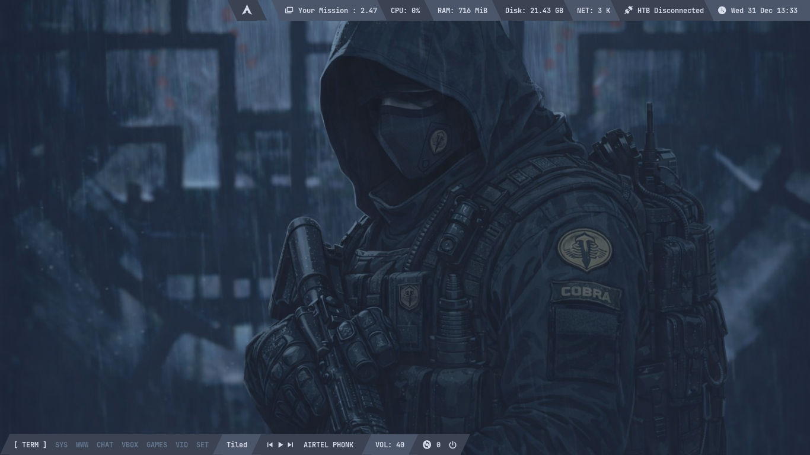

### Alacritty

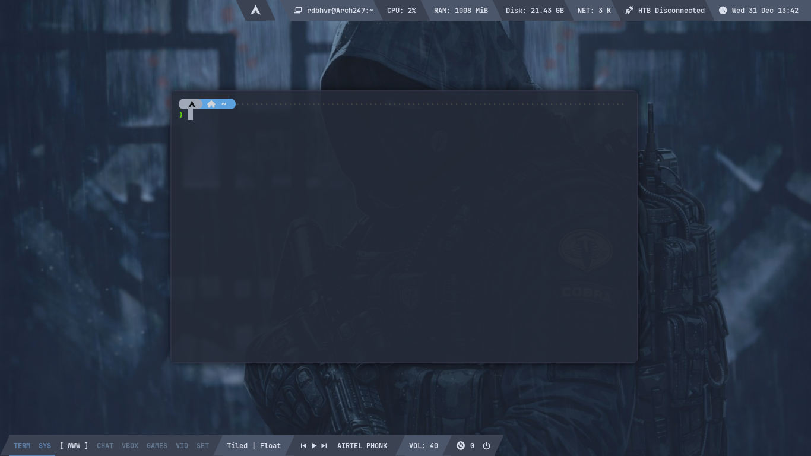

### Caja File Manager

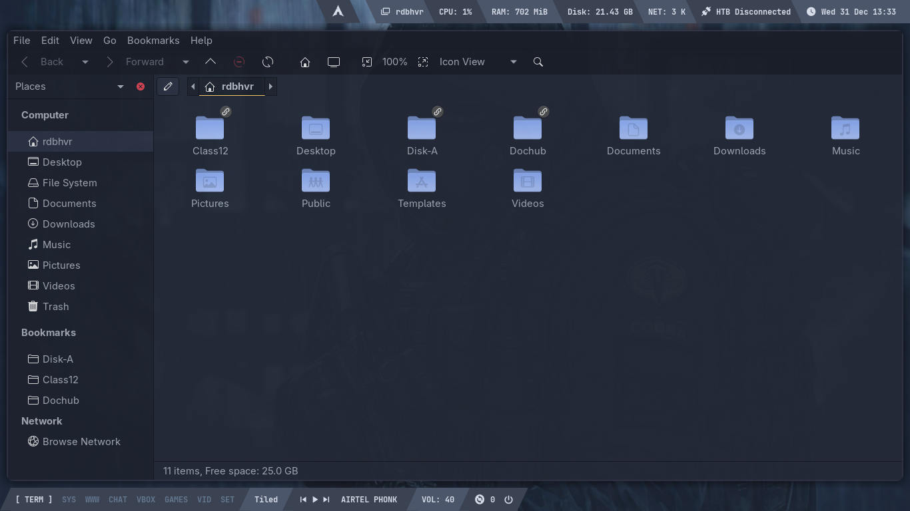

### Thunar File Manager

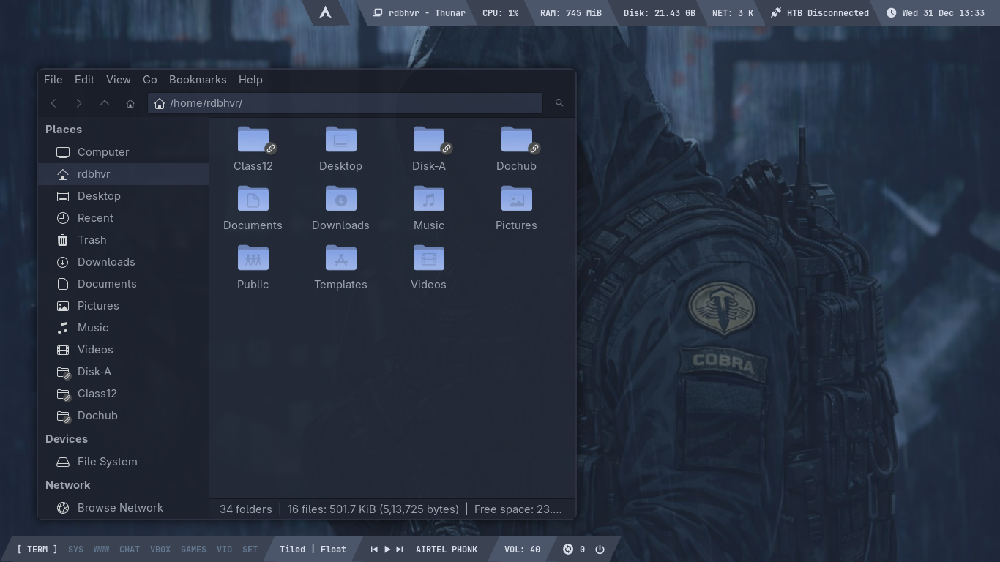

### Cmatrix in Desktop

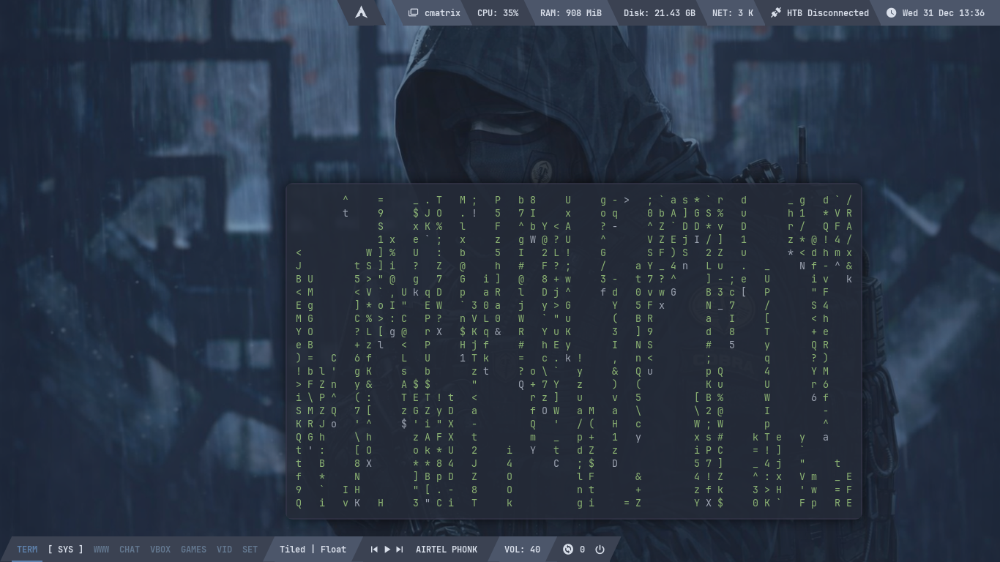

### Terminal on Caja

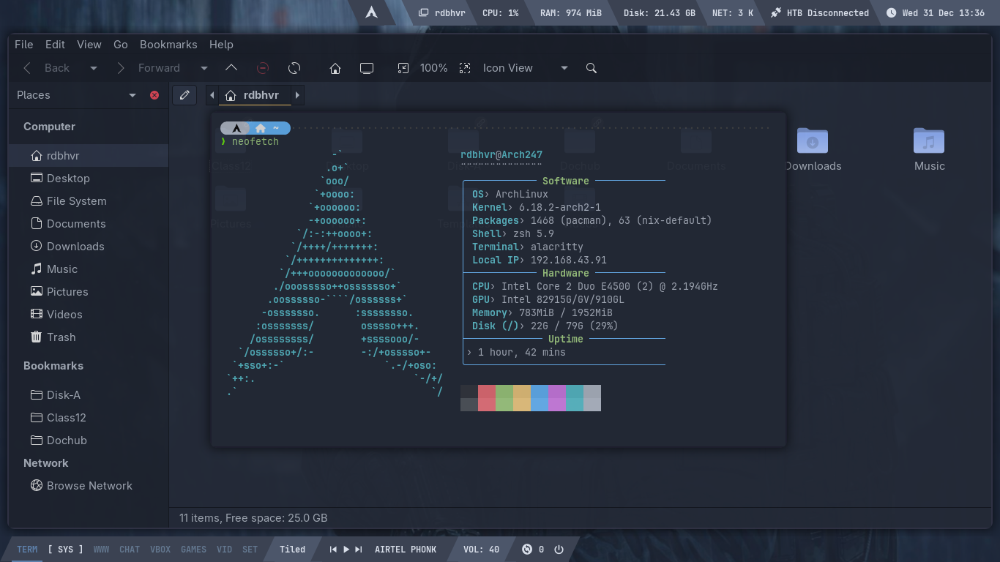

### Tiled Terminals

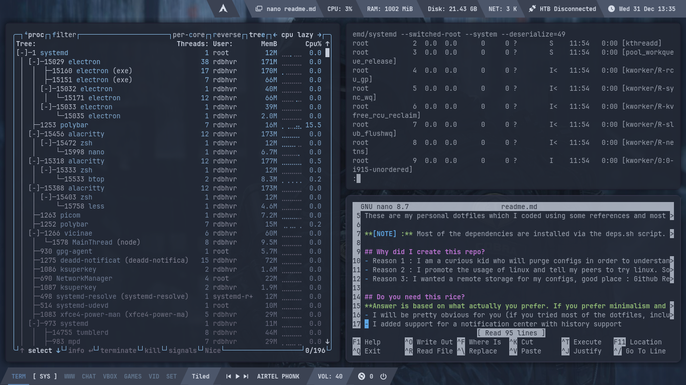

### Obsidian Interface

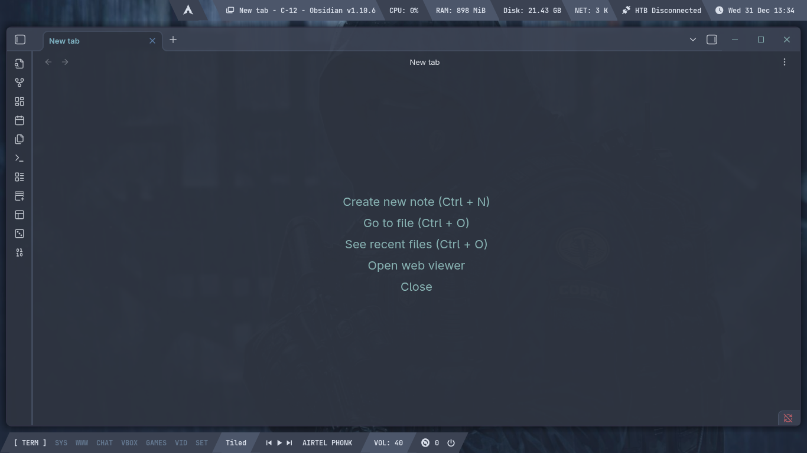

### Vicinae Launcher

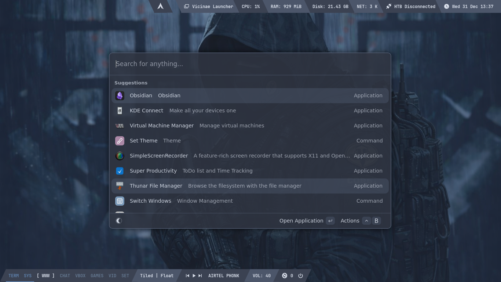

### Vicinae Wifi

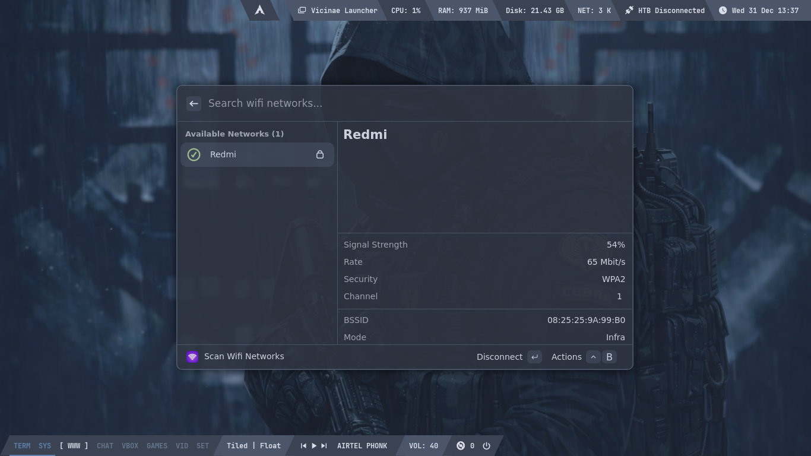

### Weather

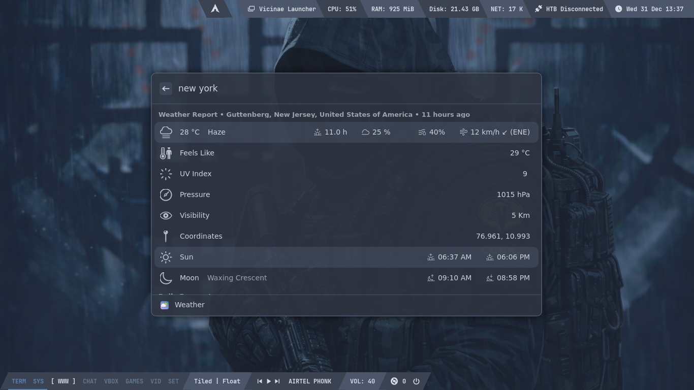

### AUR Package Searcher

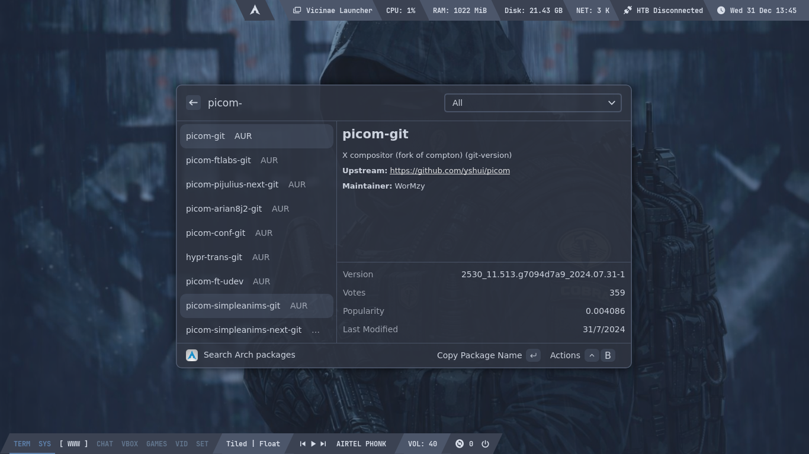

### Open Windows

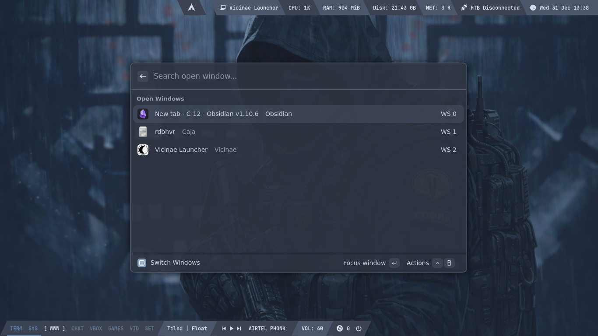

### Clipboard Manager

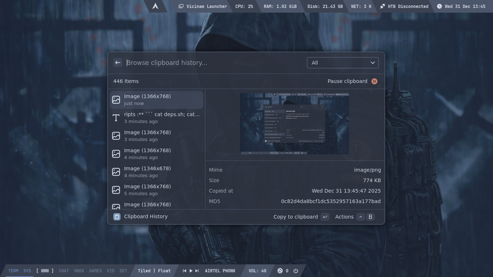

### Music Player

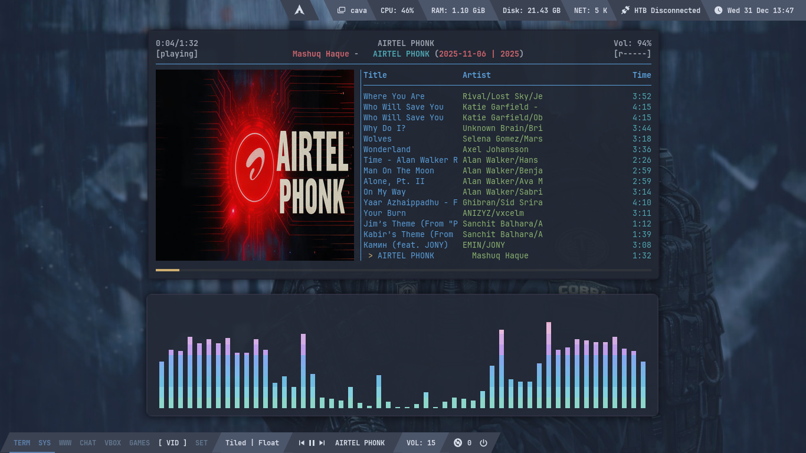

### Rofi Switchers

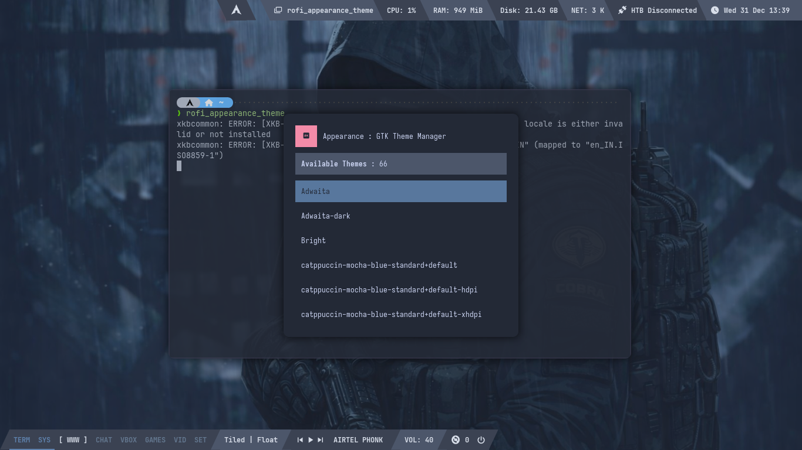
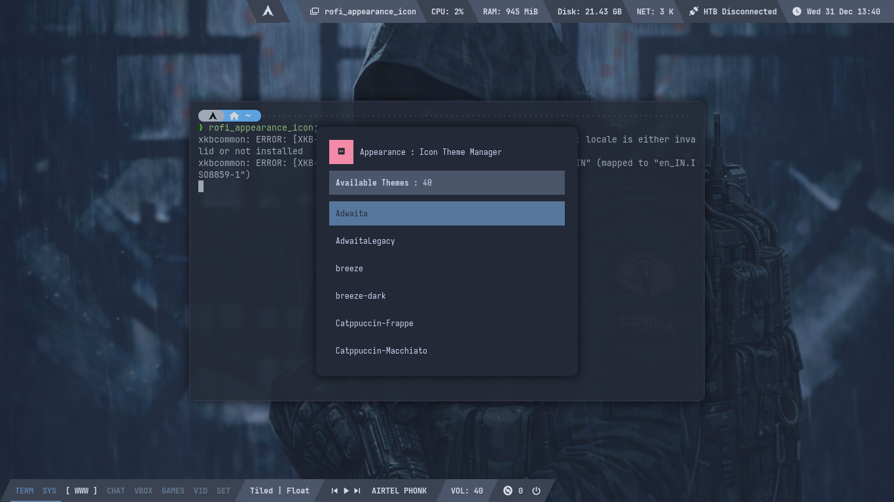
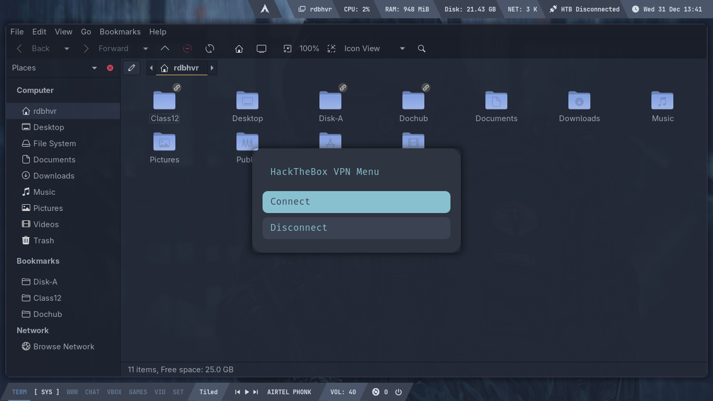
