# Bspwm Dotfiles
### For Arch Linux
_____________________
# Introduction
These are my personal dotfiles which I coded using some references and most of the configs, researching on tools like vicinae and rofi, deadd-notification-center etc to put them together as a cool minimal working model. This will be suitable for users who spend most of their time programming in terminal or using terminal and has a cli rice switcher tool to switch the rice on the fly without having to login again.

**[NOTE] :** Most of the dependencies are installed via the deps.sh script. But if some fonts did not work well, you have to manually install them using the aur helpers. (cause I literally forgot what fonts I installed, but mostly it works. You can open up an issue if you find some errors.)

## Why did I create this repo?
- Reason 1 : I am a curious kid who will purge configs in order to understand the internals. I can't spend my time reconfiguring stuffs.
- Reason 2 : I promote the usage of linux and tell my peers to try linux. Some will ask me how to configure stuffs and I can't go there and edit their configs, this is a reference for them to install a minimal and efficient window manager.
- Reason 3: I wanted a remote storage for my configs, good place : Github Repositories

## Do you need this rice?
**Answer is based on what actually you prefer. If you prefer minimalism and a terminal workflow, and use keyboard more than mouse, this dotfile will be your friend.**
- I will be pretty obvious for you (if you tried most of the dotfiles, including gh0stzk dotfiles, yes, it is a fork of gh0stzk, but only polybar as I had hard time configuring polybars, I just copied it from there.) that it seems like a fork, but it is not the exact copy of gh0stzk dotfiles. Credits : gh0stzk for polybar.
- I added support for a notification center with history support
- You will have a more functional launcher. (This config does not use rofi for launchers and wifi stuffs, instead uses **vicinae raycaster**)
- If you prefer functionality + asthetics, you can go with this dotfile, else get out of this repository and got to a safe place.

## Requirements for Installation
- **LInux Distro :** Any Arch Linux based distribution with AUR support (preferably paru, else you have to edit the deps.sh, replace all paru into yay or the helper you use.)
- **Can debian users install it?** Yes. But a hard way. You can see the dependencies listed in the dep.sh, go to their official repository, find how to install manually, then run setup.sh (comment out the `bash deps.sh` --> `#bash deps.sh` , else you will get errors from pacman)
- **The installation script will automatically backup your configs to ~/config.old** , so you can easily recover the old config if you don't like this, or have issues with installation

# Installation of Dotfiles

Follow the instructions given below to install this bspwm environment
## Dependencies
- Currently you have got zero dependencies.
- Every dep will be installed by the setup.sh.
- You may have to install the additional fonts if you run into some problem. (which is mostly unlikely to happen)
## Instructions
Follow these steps as it is.
**Clone this repository :** 
```
git clone https://github.com/rdbhvr-001/bspwm-dotfiles.git rdbhvr-dotfiles
```
**Change Directory :** 
```
cd rdbhvr-dotfiles
```
**Paranoids can have a look at scripts :** 
```
cat deps.sh; cat setup.sh
```
**Have executable permission :** 
```
chmod +x setup.sh
``` 
(if not already executable)
**Execute and have a coffee :** 
```
./setup.sh
```
Once your coffee cup turns empty, you are ready to use the freshly set up bspwm environment.

# Showcase
**You can have a look on these pics, read this documentation before installing this dotfile**
## Melissa

### Desktop


### Alacritty


### Caja File Manager


### Thunar File Manager


### Cmatrix in Desktop


### Terminal on Caja


### Tiled Terminals


### Obsidian Interface


### Vicinae Launcher


### Vicinae Wifi


### Weather


### AUR Package Searcher


### Open Windows


### Clipboard Manager


### Music Player


### Rofi Switchers


## Cristina

### Desktop

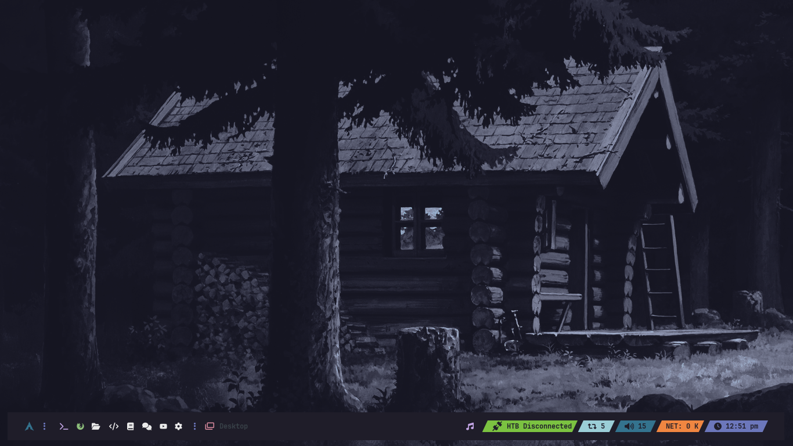

### Alacritty

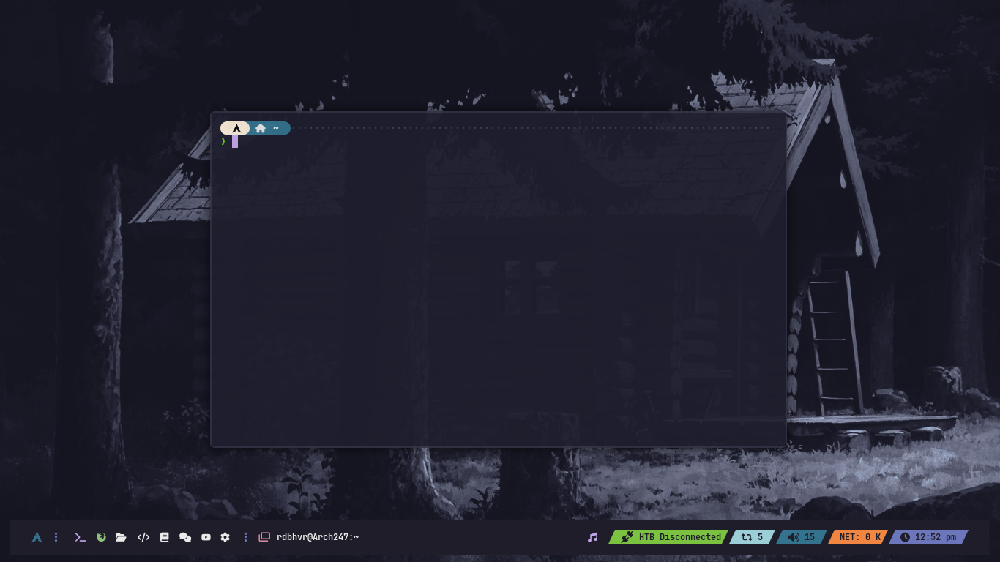

### Caja File Manager

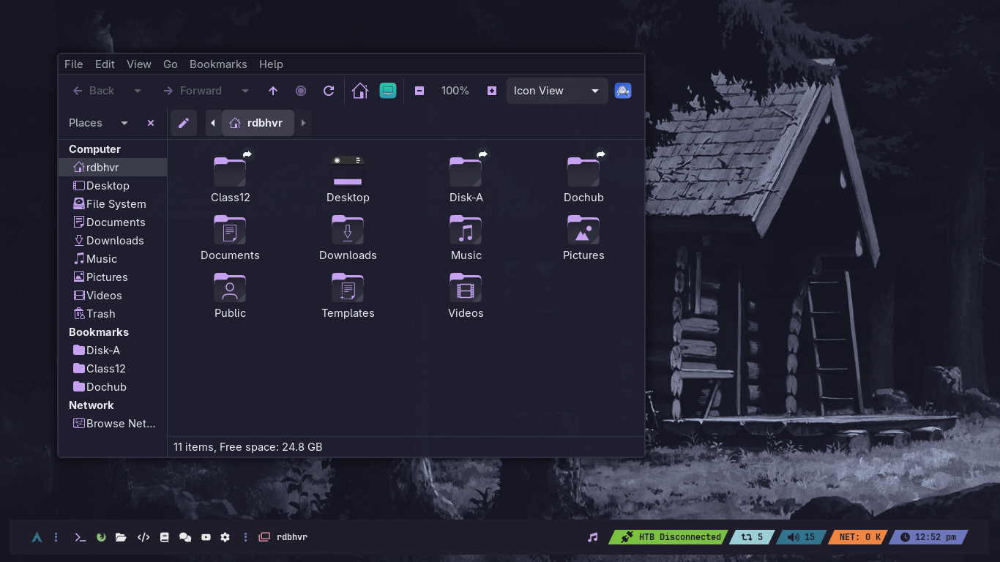

### Thunar File Manager

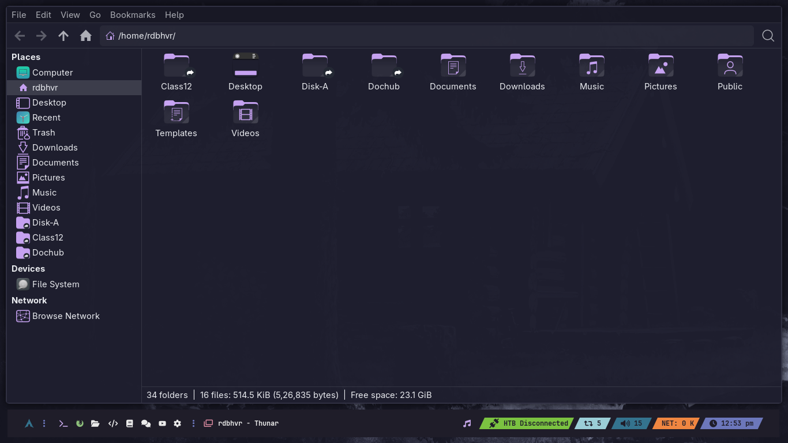

### Cmatrix in Desktop

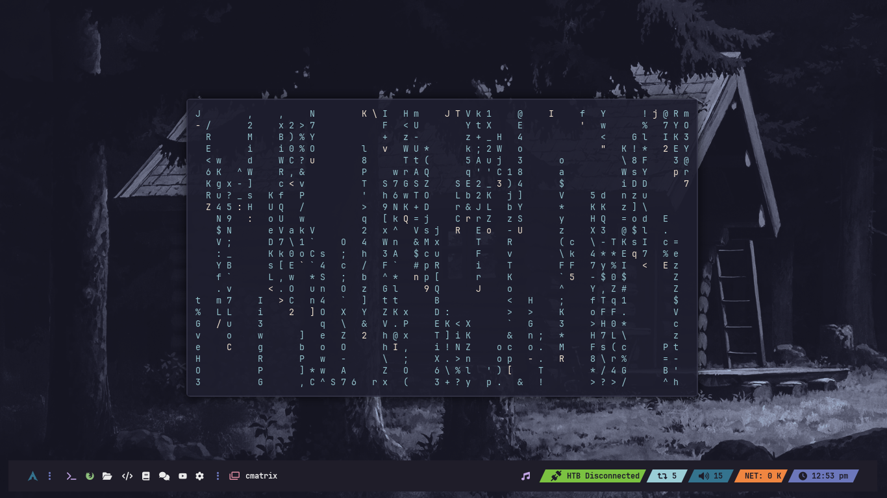

### Terminal on Caja

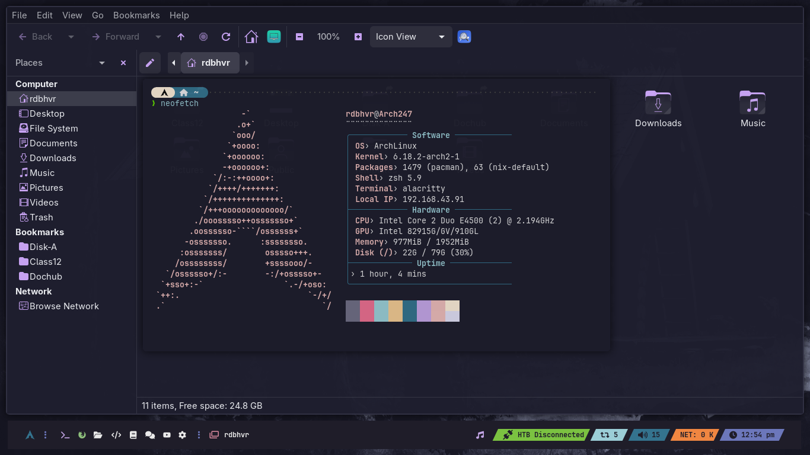

### Tiled Terminals

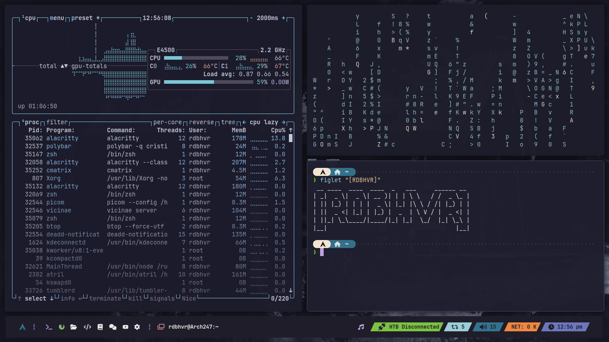

### Vicinae Launcher

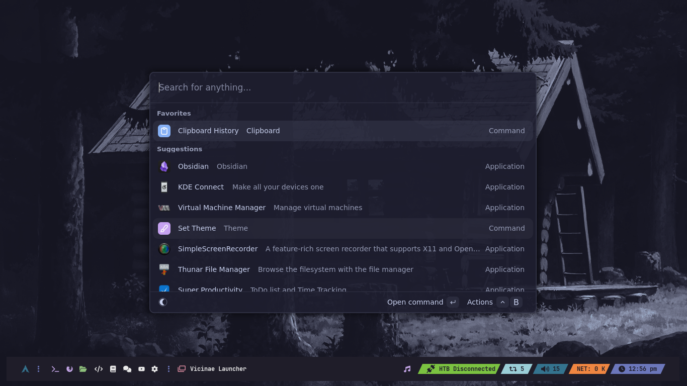

### Vicinae Wifi

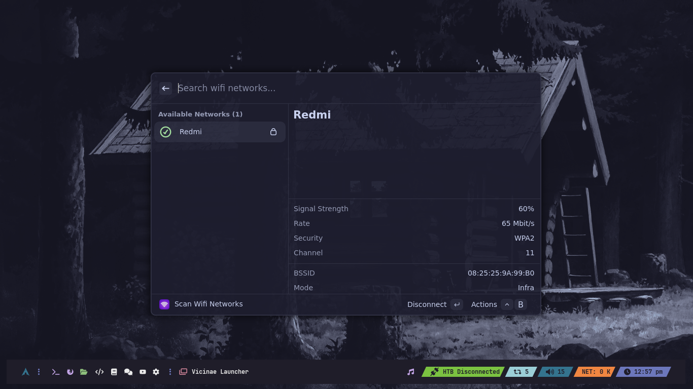

### Weather

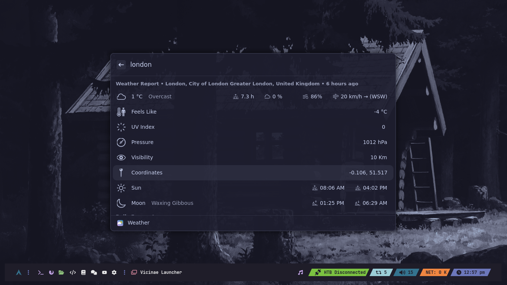

### AUR Package Searcher

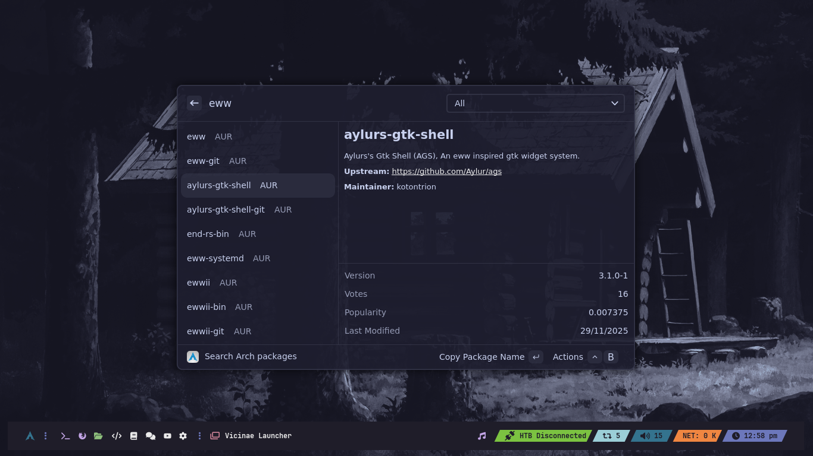

### Open Windows

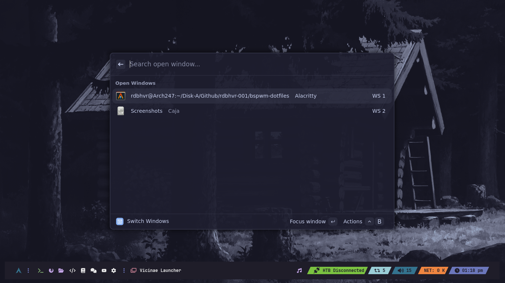

### Clipboard Manager

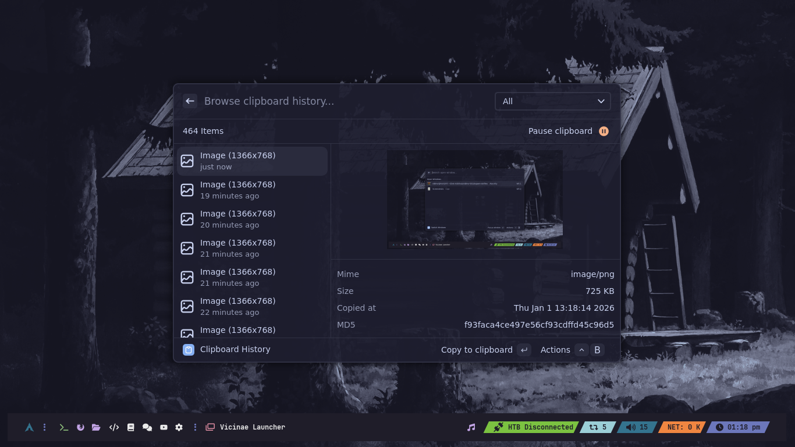

### Music Player


### Rofi Switchers


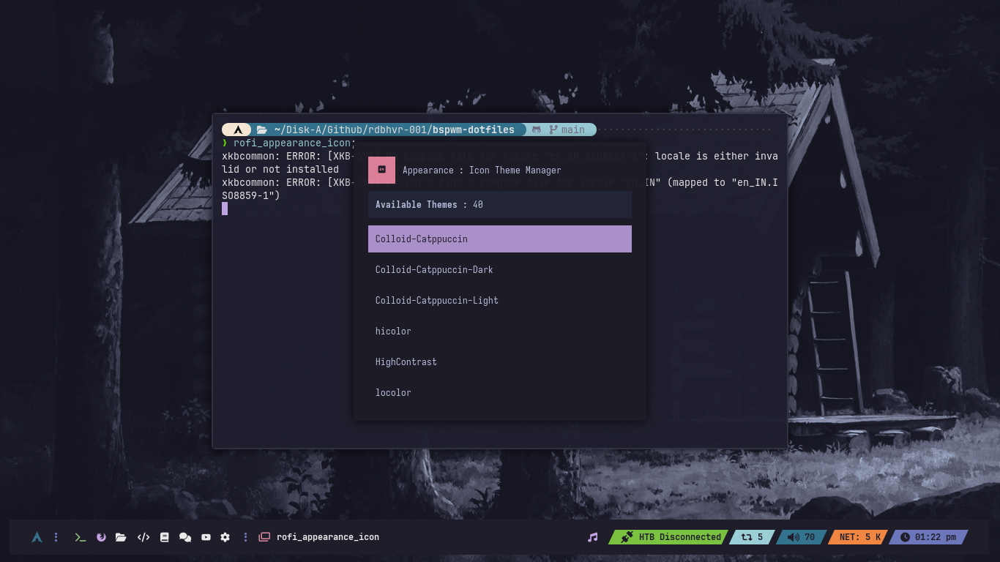
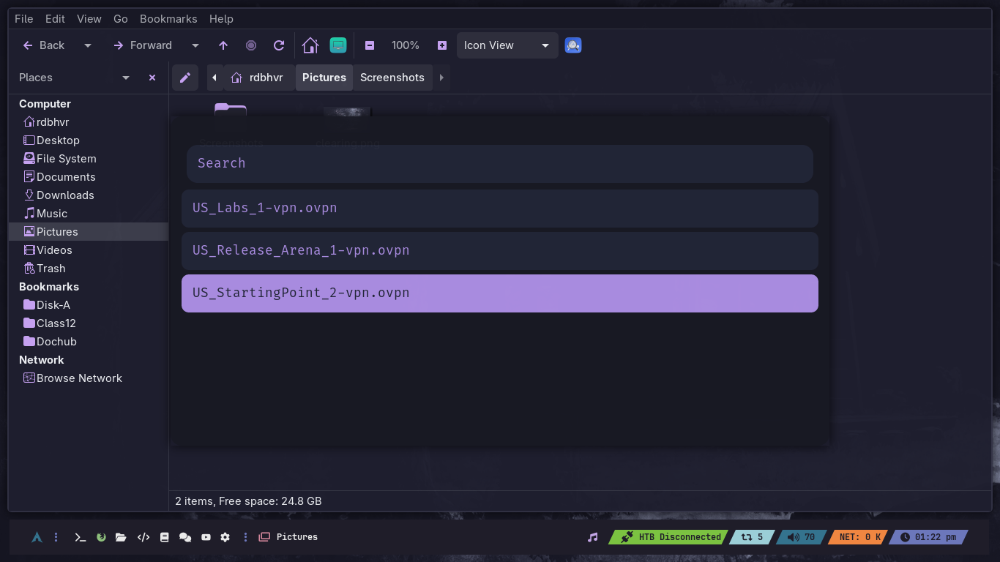

# Keybindings

Below given is a list of keybindings which is mandatory for the user to know if you live in keyboard.
I have included most of the keybindings here. Additionally you can include other keybindings or edit the keybindings in `sxhkdrc`, feel free to add yours.
**[NOTE]** : Vicinae deeplinks are a good way to speed up your workflow. You can see it in the bottom of the sxhkdrc file. To have a glimpse of the keybindings now and then, you can alias it.

```
echo "alias keybindings='cat ~/.config/bspwm/sxhkdrc'" >> ~/.zshrc
```

Now you can press `super + shift + return` to open the terminal, `keybindings` to see the hotkeys.

### Terminals

- `super + Return`  
  Notify + open alacritty fullscreen (warning message)  
  Command: `notify-send ... && alacritty`

- `super + shift + Return`  
  Notify + open alacritty floating  
  Command: `notify-send ... && bspterm --float`

- `super + alt + Return`  
  Open terminal fullscreen  
  Command: `bspterm --full`

- `ctrl + alt + t`  
  Open kitty  
  Command: `kitty`

---

### Applications

- `super + shift + w` → Launch Firefox  
- `super + shift + e` → Launch Geany  
  Command: `{firefox,geany}` via sxhkd brace expansion style [web:1]

- `ctrl + alt + v` → Open Vim in alacritty (custom config)  
- `ctrl + alt + r` → Open Ranger in alacritty (custom config)  
- `ctrl + alt + h` → Open btop in alacritty (custom config)

- `super + p` → Color Picker (`bspcolorpicker`)  
- `ctrl + alt + m` → Music (`bspmusic`)  
- `super + l` → Lockscreen (`betterlockscreen --lock`)

---

### System keys (utils)

- `XF86MonBrightnessUp` / `XF86MonBrightnessDown`  
  Brightness control (`bspbrightness --inc/--dec`)

- `XF86AudioRaiseVolume` / `XF86AudioLowerVolume`  
  Speaker volume (`bspvolume --inc/--dec`)

- `XF86AudioMute` / `XF86AudioMicMute`  
  Toggle speaker mute / toggle mic mute (`bspvolume --toggle/--toggle-mic`)

- `XF86AudioNext` / `XF86AudioPrev` / `XF86AudioPlay` / `XF86AudioStop`  
  Music control via `mpc next/prev/toggle/stop`

---

## bspwm

### Window actions

- `F8` → Hide/Unhide window (`bspwinmask`)
- `super + c` → Close app (`bspc node -c`)
- `super + shift + c` → Kill app (`bspc node -k`)
- `ctrl + alt + Escape` → Notify + `xkill`

### Session actions

- `ctrl + shift + q` → Notify + sleep 5 + quit (`bspc quit`)
- `ctrl + shift + r` → Notify + sleep 5 + restart wm (`bspc wm -r`)
- `super + Escape` → Notify + reload sxhkd (`pkill -USR1 -x sxhkd`) [web:1]

---

### Workspaces/desktops

- `ctrl + alt + Left` / `ctrl + alt + Right`  
  Switch workspace prev/next local (`bspc desktop -f prev.local/next.local`)

- `super + 1..8`  
  Switch workspace to desktop 1–8

- `super + shift + 1..8`  
  Send focused node to desktop 1–8 and follow (`--follow`) [web:1]

- `super + ctrl + shift + Left` / `super + ctrl + shift + Right`  
  Send focused node to prev/next desktop and follow

---

### Focus / swap / move / resize

- `super + Left/Down/Up/Right` → Focus node west/south/north/east  
- `super + shift + Left/Down/Up/Right` → Swap nodes west/south/north/east

- `super + alt + shift + Left/Down/Up/Right`  
  Move floating windows by 20px steps

- `super + control + Left/Right/Up/Down`  
  Expand window edge by 20px steps

- `super + alt + Left/Right/Up/Down`  
  Shrink window edge by 20px steps

---

### Split / ratio / layout / modes

- `super + h` → Preselect split south  
- `super + v` → Preselect split east  
- `super + q` → Cancel preselect

- `super + ctrl + 1..9` → Preselect ratio 0.1–0.9

- `F9` → Toggle Layout (tiled/monocle) next
- `F10` → Toggle fullscreen
- `F11` → Toggle between floating & tiled
- `F12` → Toggle pseudo tiled & tiled mode

- `super + ctrl + m` → Marked flag
- `super + ctrl + x` → Locked flag
- `super + ctrl + y` → Sticky flag
- `super + ctrl + z` → Private flag

- `alt + Tab` → Focus next window (including floating)  
- `alt + shift + Tab` → Focus previous window

- `super + Tab` → Focus last node
- `super + grave` → Focus last desktop

---

## Screenshots

- `Print` → Screenshot now (`bspscreenshot --now`)
- `alt + Print` → Screenshot in 5 sec (`bspscreenshot --in5`)
- `shift + Print` → Screenshot in 10 sec (`bspscreenshot --in10`)
- `ctrl + Print` → Screenshot active window (`bspscreenshot --win`)
- `super + Print` → Screenshot area (`bspscreenshot --area`)

---

## Custom-made

- `F1` → Caja
- `super + space` → `vicinae toggle`

- `super + i` → Toggle notification center  
  Command: `kill -s USR1 $(pidof deadd-notification-center)`

- `super + x` → Clipboard history (vicinae deeplink)
- `super + a` → Search Arch packages (vicinae deeplink)
- `super + w` → Weather (vicinae deeplink)
- `super + n` → `vicinae-wifi`
- `super + o` → Switch windows (vicinae deeplink)

---

## Power management

- `alt + Delete + s` → Poweroff (`systemctl poweroff`)
- `alt + Delete + r` → Reboot (`systemctl reboot`)
- `alt + Delete + l` → Quit bspwm (`bspc quit`)

# Switching Rice
I use a cli rice switcher for the purpose of switch rices.
To switch a rice, open your terminal, type :

```
rice_help
```

It will show you the help, follow as instructed.

# Conclusion
It is up to you to choose whether or not to use this dofile. If you like my work, you can **give it a star**, or contribute to my dotfiles by opening a pull request.
If you encounter some issues, you can open and discuss it in **issues** of this repo.
**Want to know more about me?** https://rdbhvr-001.github.io/
